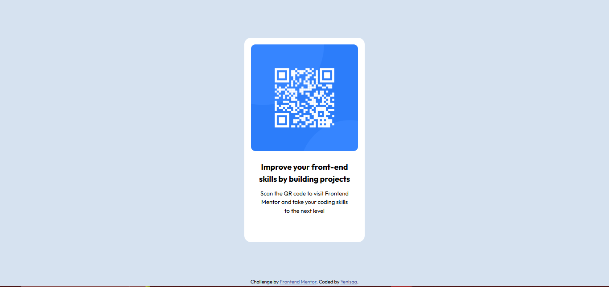

# Frontend Mentor - QR code component solution

This is a solution to the [QR code component challenge on Frontend Mentor](https://www.frontendmentor.io/challenges/qr-code-component-iux_sIO_H). Frontend Mentor challenges help you improve your coding skills by building realistic projects.

## Table of contents

- [Overview](#overview)
  - [Screenshot](#screenshot)
  - [Links](#links)
  - [Built with](#built-with)
  - [What I learned](#what-i-learned)
  - [Continued development](#continued-development)
  - [Useful resources](#useful-resources)
- [Author](#author)

## Overview

### Screenshot



### Links

- Solution URL: [Click to check code](https://github.com/yenisaa/QR-code-component-solution)
- Live Site URL: [Click to view project](https://qrcodecomps.netlify.app/)

### Built with

- Semantic HTML5 markup
- CSS custom properties
- Flexbox

### What I learned

Working on this project exposed me to working with external typography. The typeface used in this project is a google font called OUTFIT. Initially, I didn't know how to work with it without downloading it to my laptop but after some research, I was able to do it successfully. I also learned how to use the font shorthand in css. I didn't know it was a thing until I read about it on W3school during my research

This is the link I used, see below:

```html
<link
  href="https://fonts.googleapis.com/css2?family=Outfit:wght@100..900&display=swap"
  rel="stylesheet"
/>
```

### Continued development

I'm sure the ways of doing the same thing will change in a few years so, i wouldn't mind revisiting this project and updating the code. Maybe I might not even write up to a hundred lines of css to achieve this same result... So until then, I plan to keep learning, unlearning, and re-learning.

### Useful resources

- [W3School](https://www.w3schools.com/css/css_font_shorthand.asp) - I learned an easy way to work with fonts using shorthands. I really liked this pattern and will use it going forward.
- [Google Font](https://fonts.google.com/selection/embed) - This is an amazing website that did not just gave me a cool font to use but also helped me finally understand how to embed fonts into your project without downloading them to your computer. I'd recommend it to anyone still learning this concept.

## Author

- Github - [Isaiah Yenou](https://github.com/yenisaa)
- Frontend Mentor - [@yenisaa](https://www.frontendmentor.io/profile/yenisaa)
- X - [@heisyenisa](https://x.com/heisyenisa)
